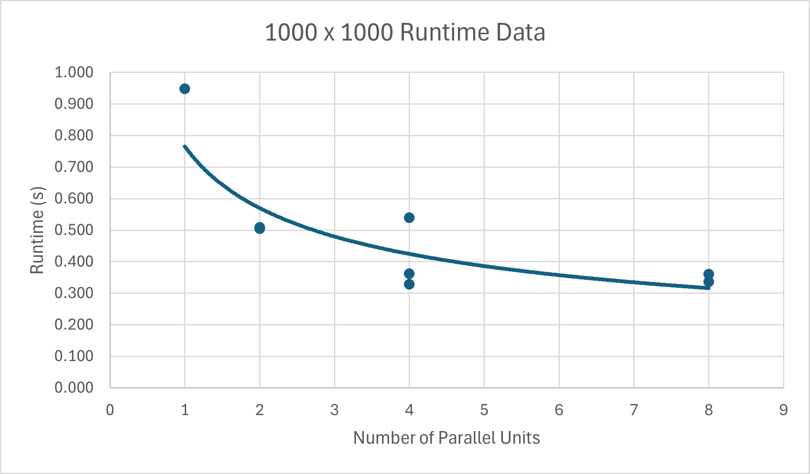
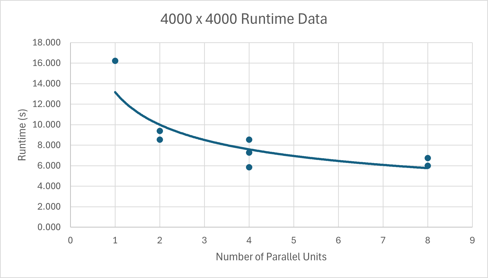

# Conway's Game of Life - Parallel Implementation (MPI + OpenMP)

This Repo implements **Conway's Game of Life** using both **MPI** and **OpenMP** for parallel processing. The program supports configurable grid size, number of generations, random seed, and optional visualisation.  

It is designed for **Linux**.

---

## Features

- **MPI** Distributed memory (process-based parallelism)
- **OpenMP** Shared memory (thread-based parallelism)
- Hybrid **MPI + OpenMP** parallelisation
- Performance reporting of Runtime and memory usage

---

## Requirements

- `mpicc` (MPI C compiler)
- OpenMP support (`-fopenmp`)
- Linux environment

---

## Compilation

Use the provided Makefile:

```bash
make
```

This will compile the main program and create the executable `life`.

---

## Running the Program

### Default Program Execution

Some default executables have been provided in the Makefile and can be run.

For Serial processing:

```bash
make run-serial
```

For Hybrid processing:

```bash
make run-hybrid
```

For Visualisation:

```bash
make run-vis
```

More default commands are available in the Makefile.

### Command-line arguments

```bash
./life <rows> <cols> <generations> <seed> <visual>
```

| Argument        | Description |
|-----------------|-------------|
| `rows`          | Number of rows in the grid |
| `cols`          | Number of columns in the grid |
| `generations`   | Number of generations to simulate |
| `seed`          | Random seed for reproducible initial state |
| `visual`        | `1` to enable visual display, `0` for benchmark mode |

---

### Using OpenMP and MPI

You can control the number of **OpenMP threads** and **MPI processes** via:

```bash
OMP_NUM_THREADS=<threads> mpiexec -np <processes> ./life <rows> <cols> <generations> <seed> <visual 0/1>
```

**Examples:**

- Benchmark mode (no visualisation):

```bash
OMP_NUM_THREADS=2 mpiexec -np 4 ./life 1000 1000 50 42 0
```

- Visual mode (small grid recommended):

```bash
OMP_NUM_THREADS=2 mpiexec -np 1 ./life 30 60 20 42 1
```

---

## Creating Custom Executables

You can compile your own executable using `mpicc` and OpenMP:

```bash
mpicc -fopenmp -O2 -o my_life main.c
```

Then run it like:

```bash
OMP_NUM_THREADS=4 mpiexec -np 2 ./my_life 1000 1000 50 42 0
```

---

## Performance Data

### Grid: 1000 × 1000 with 200 Generations

| OpenMP Threads | MPI Processes | Time (s) |
|----------------|---------------|-----------|
| 1              | 1             | 0.949     |
| 1              | 2             | 0.509     |
| 2              | 1             | 0.505     |
| 1              | 4             | 0.328     |
| 4              | 1             | 0.539     |
| 2              | 2             | 0.362     |
| 2              | 4             | 0.337     |
| 4              | 2             | 0.361     |



### Grid: 4000 × 4000

| OpenMP Threads | MPI Processes | Time (s) |
|----------------|---------------|-----------|
| 1              | 1             | 16.214    |
| 1              | 2             | 9.390     |
| 2              | 1             | 8.550     |
| 1              | 4             | 7.281     |
| 4              | 1             | 8.549     |
| 2              | 2             | 5.837     |
| 2              | 4             | 5.994     |
| 4              | 2             | 6.750     |



As seen in the performance data, generally as the number of processes increases the runtime decreases in a decaying exponential trend.

### 10000 x 10000 with 500 Generations

Increasing the number of rows and columns was noted to have a more profound effect on the overall effectiveness of the parallel workers.

| OpenMP Threads | MPI Processes | Time (s) |
|----------------|---------------|-----------|
| 1              | 1             | 405.227    |
| 4              | 2             | 55.470     |

With 10000 rows and columns and 500 generations the program's runtime had decreased by **630%**.

> These measurements were taken using **WSL2 on Windows 11** using 10 Core Intel i7-13620H

---

## Notes

- Visualisation mode (`visual=1`) is recommended only for **small grids**, as printing a large grid slows the simulation.  
- The program reports runtime, memory usage, number of MPI processes, number of OpenMP threads, and theoretical time & space complexity.  
